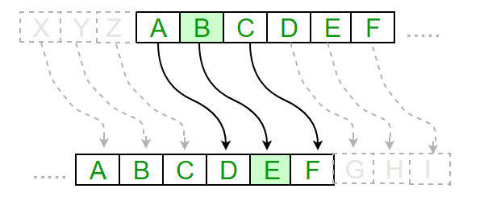
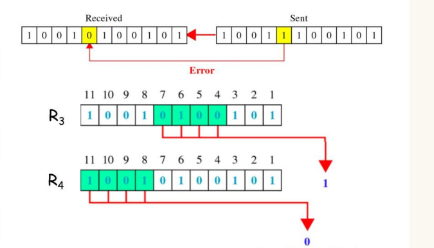
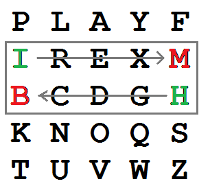
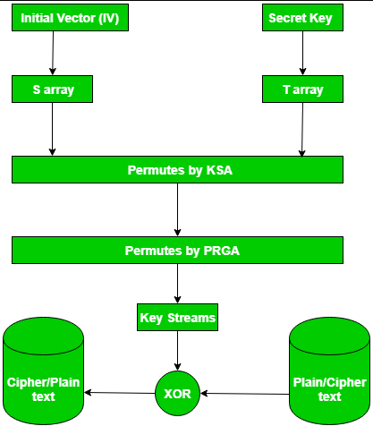

# C++ Encryption Algorithms

This C++ project implements several encryption algorithms, including Caesar, Hamming, Playfair, and RC4. Each algorithm is implemented in a separate C++ file.

## Algorithms Included:

1. **Caesar Cipher (caesar.cpp):**
   - The Caesar cipher is a basic substitution cipher where each letter in the plaintext is shifted by a fixed number of positions down the alphabet.

   

2. **Hamming Code (hamming.cpp):**
   - Hamming code is an error-correcting code that adds extra bits to data to detect and correct errors in transmitted data.

   

3. **Playfair Cipher (playfair.cpp):**
   - The Playfair cipher is a symmetric key substitution cipher that encrypts pairs of letters, making it more resistant to certain types of cryptanalysis.

   

4. **RC4 (rc4.cpp):**
   - RC4 is a widely used symmetric stream cipher. It is known for its simplicity and efficiency in generating a pseudorandom stream of bits.

   

## Usage:

1. **Caesar Cipher:**
   ```bash
   g++ caesar.cpp -o caesar
   ./caesar
   ```

2. **Hamming Code:**
   ```bash
   g++ haming.cpp -o haming
   ./haming
   ```

3. **Playfair Cipher:**
   ```bash
   g++ playfair.cpp -o playfair
   ./playfair 
   ```

4. **RC4**
   ```bash
   g++ rc4.cpp -o rc4
   ./rc4 
   ```#
